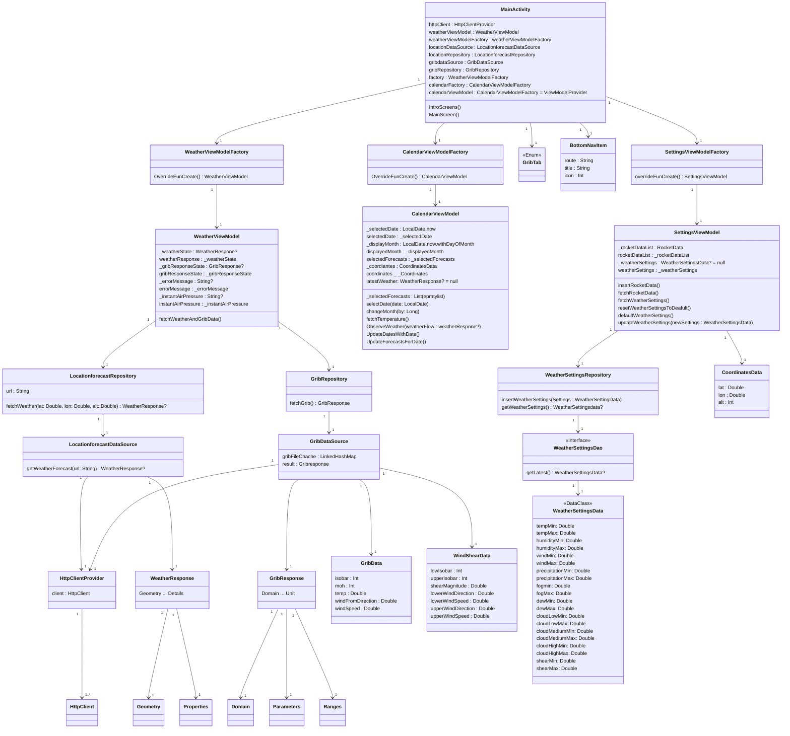
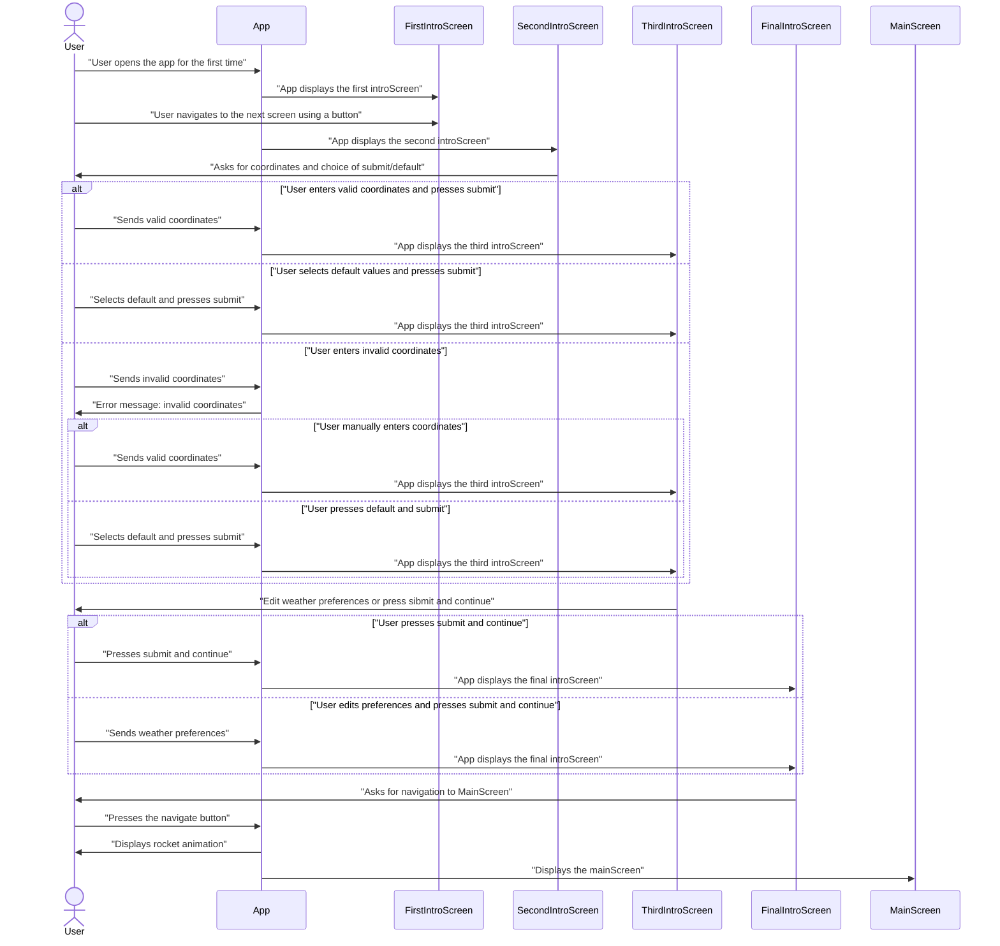
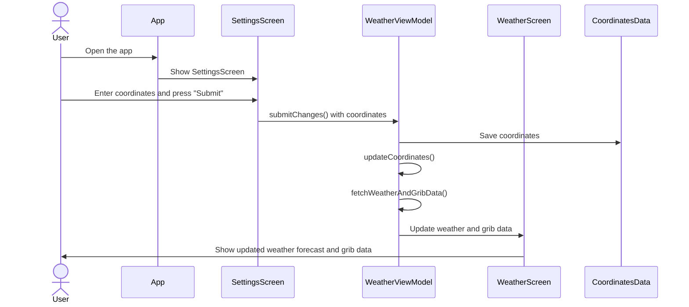
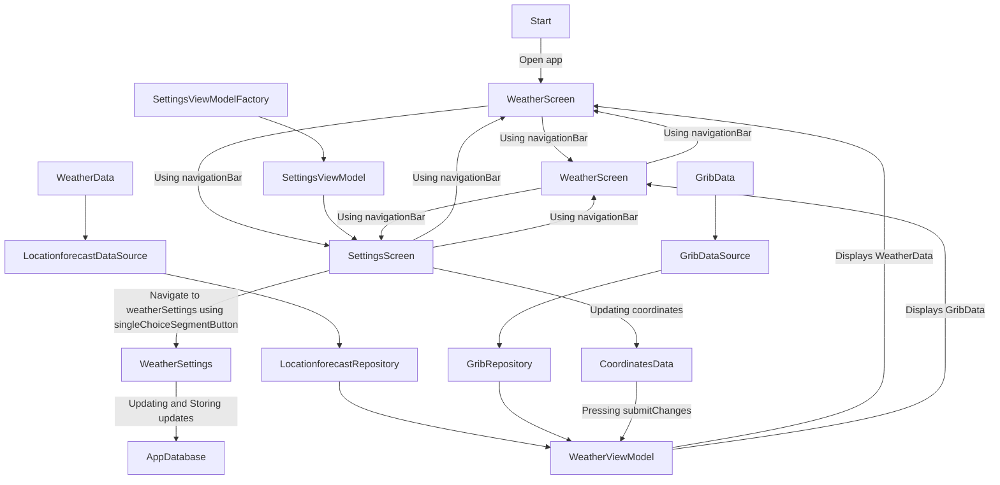

# **MODELING**
This document is created for developers who will continue working on the app, get familiar with it, and contribute to its development. It shows the app's architecture through diagrams and descriptions. This document includes the following diagrams:
- Class diagram
- Sequence diagram for the introScreens
- Sequence diagram for changing coordinates in settings
- Flowchart for navigation through the app
- Architectural sketch
- UseCase diagram for showing weatherdata and updating coordinates

## **CLASSDIAGRAM**

### **CLASS DIAGRAM DESCRIPTION**
- #### MainActivity
  - This diagram shows a simplified version of the class structure of the app. It contains a MainActivity that creates objects of DataSources, Repositories, ViewModelFactories, ViewModels, and the database.
- #### DataSources
  - Generates a response from the API using HttpClient.
- #### Repositories
  - Contains functions for fetching data from data sources.
- #### ViewModelFactories
  - Allows us to generate ViewModels that take arguments as parameters.
- #### ViewModels
  - Used to handle logic and some data storage.
- #### DataClasses (most data classes are excluded from this diagram due to redundancy)
  - Used to hold data when parsing from the API.
- #### Database
  - Used for storing data such as weather settings

## **EXTENSION OF CLASS DIAGRAM (The excluded data-classes)**

```mermaid
classDiagram

%% Weatherforecast


    class Geometry {
        type : String 
        coordiantes : List<Double>    
    }

    class Properties {
        meta : Meta
        timeseres : List<Timeseries>
    }

    class Meta {
        updatedAt : String
        units = Units
    }

    class Timeseries {
        time : String
        data : Data
    }

    class Data {
        instant : Instant? = null
        next12Hours : Next12Hours? = null
        next1Hours = Next1Hours? = null
        next6Hours = Next6Hours? = null
    }

    class Instant {
        details : Details
    }

    class Next12Hours {
        summary : Summary
        details : Details
    }

    class Next1Hours {
        summary : Summary 
        details : Details 
    }

    class Next6Hours {
        summary : Summary
        details : Details 
    }

    class Units {
        airPressureAtSeaLevel : String 
        airTemperature : String 
        airtemperatureMax : String 
        airTemperatureMin : String
        airTemperaturePercentile90 : String 
        airTemperaturePercentile10 : String 
        cloudAreaFraction : String 
        cloudAreaFractionHigh : String 
        cloudAreaFractionLow : String
        cloudAreaFractionMedium : String
        dewPointTemperature : String 
        fogAreaFraaction : String 
        precipitationAmmount : String
        precipitationAmmountMax : String
        precipitationAmmountMin : String
        probabilityOfPrecipitation : String
        probabilityOfThunder : String
        relativeHumidity : String 
        ultravioletIndexClearSky : Int 
        windFromDirection : String
        windSpeed : String 
        windSpeedOfGust : String 
        windSpeedPercentile10 : String 
        windSpeedPercentile90 : String 
    }

    class Summary {
        symbolCode : String 
    }

    class Details {
        airPressureAtSeaLevel : Double? = null
        airTemperature : Double? = null
        airTemperatureMax : Double? = null
        airTemperatureMin : Double? = null
        airTemperaturePercentile90 : Double? = null
        airTemperaturePercentile10 : Double? = null
        cloudAreaFraction : Double? = null
        cloudAreaFractionHigh : Double? = null
        cloudAreaFractionLow : Double? = null
        cloudAreaFractionMedium : Double? = null
        dewPointTemperature : Double? = null
        fogAreaFraction : Double? = null
        precipitationAmount : Double? = null
        precipitationAmountMax: Double? = null
        precipitationAmountMin: Double? = null
        probabilityOfPrecipitation: Double? = null
        probabilityOfThunder: Double? = null
        relativeHumidity : Double? = null
        ultravioletIndexClearSky : Double? = null
        windFromDirection : Double? = null  
        windSpeed : Double? = null
        windSpeedOfGust : Double? = null
        windSpeedPercentile10 : Double? = null
        windSpeedPercentile90 : Double? = null
    }

%% grib

class Domain {
        %% Data class
        type : String
        domainType : String
        axes : Axes
        referencing : List<Referencing>
    }

    class Axes {
        %% Data class
        x : X
        y : Y
        z : Z
        t : T
    }

    class X {
        %% Data class
        values : List<Double>
    }

    class Y {
        %% Data class
        values : List<Double>
    }

    class Z {
        %% Data class
        values : List<Int>
    }

    class T {
        %% Data class
        values : List<String>
    }

    class Referencing {
        %% Data class
        coordinates : List<String>
        system : System
    }

     class System {
        %% Data class
        type : String
        id : String
        cs : Cs? = null
        calendar = String? = null
    }

    class Cs {
        csAxes : List<CsAxes>
    }

    class CsAxes {
        name : Name
        direction : String 
        unit : UnitCs
    }

    class Name {
        en : String
    }

    class UnitCs {
        symbol : String
    }

     class Parameters {
        %% Data class
        temperature : ParamsTemperature
        wind_from_direction : ParamsWindFromDirection
        wind_speed : ParamsWindSpeed
    }

    class ParamsTemperature {
        type : String
        id : String
        label : Label
        observedProperty : ObservedProperty
        unit : Unit
    }

    class Temperature {
        type : String
        dataType : String
        axisName : List<String>
        shape : List<Int>
        values : List<Double> 
    }

    class ParamsWindFromDirection {
        type : String 
        id : Sting 
        label : Label 
        observedProperty : ObservedProperty
        unit : Unit
    }

    class WindFromDirection {
        type : String 
        dataType : Sting 
        axisNames : List<String>
        shape : List<Int>
        values : List<Double>
    }

    class ParamsWindSpeed {
        type : String
        id : String 
        label : Label 
        ovservedProperty : ObservedProperty 
        unit : Unit
    }

    class WindSpeed {
        type : String 
        dataType : String
        axisNames : List<String>
        shape : List<Int>
        values : List<Double>
    }

    class Ranges {
        temperature : Temperature 
        wind_from_direction : WindFromDirection
        wind_speed : WindsSpeed
    }

    class Label {
        en : String
    }

    class ObservedProperty {
        id : String
        label : Label 
    }

    class Unit {
        id : String
        label : Label
        symbol : String
    }

%% WEATHER
    Domain --> Axes
    Domain --> Referencing
    
    Axes --> X
    Axes --> Y
    Axes --> Z
    Axes --> T

    Referencing --> System 

    System --> Cs

    Cs --> CsAxes

    CsAxes --> Name
    CsAxes --> UnitCs

    Parameters --> ParamsTemperature
    Parameters --> ParamsWindFromDirection
    Parameters --> ParamsWindSpeed

    ParamsTemperature --> Label 
    ParamsTemperature --> ObservedProperty
    ParamsTemperature --> Unit

    ParamsWindSpeed --> Label
    ParamsWindSpeed --> ObservedProperty
    ParamsWindSpeed --> Unit 

    Ranges --> Temperature 
    Ranges --> WindFromDirection
    Ranges --> WindSpeed 

    ObservedProperty --> Label

    Unit --> Label 

%% GRIB
    Properties --> Meta
    Properties --> Timeseries

    Meta --> Units

    Timeseries --> Data
    
    Data --> Instant
    Data --> Next12Hours 
    Data --> Next1Hours
    Data --> Next6Hours 

    Instant --> Details 

    Next12Hours --> Summary 
    Next12Hours --> Details
    
    Next1Hours --> Summary
    Next1Hours --> Details
    
    Next6Hours --> Summary
    Next6Hours --> Details
```

### **EXTENDED CLASS DIAGRAM DESCRIPTION**
All the data classes were removed from the class diagram due to redundancy. The diagram is included here to help future developers working on this project understand how the classes work together.

## **SEQUENSE DIAGRAMS**
We made sequence diagrams for two cases:
- IntroScreens
- SettingsScreen

### **INTROSCREENS SEQUENCE DIAGRAM**

### **INTROSCREENS SEQUENCE DIAGRAM DESCRIPTION**
This diagram describes the scenario when a user opens the app for the first time and goes through the **IntroScreens**. It includes various alternative routes for completing the intro, such as entering coordinates manually or using the default button before submitting. This diagram was included because it covers a small part of the app, but involves many screens and several decisions to be made.

## **SETTINGSSCREEN SEQUENCE DIAGRAM**

### **SETTINGSSCREEN SEQUENCE DIAGRAM DESCRIPTION**
This diagram shows the case when a user changes coordinates in the SettingsScreen. This diagram was included because it is informative and shows how **WeatherViewModel** saves the coordinates as **CoordinatesData** within itself. This is due to complications caused by some spaghetti code.

## **FLOWCHART**

### **FLOWCHART DESCRIPTION**
The flowchart shows how the user can navigate through the app. This diagram was included because it shows every navigation move through the app and displays it more simply than a sequence diagram. The navigation is controlled using a bottom navigation bar.

## **ARCHITECTURAL SKETCH**

### **ARCHITECTURAL SKETCH DESCRIPTION**
The architectural sketch shows the combined structure, including the data, model, and UI. It is helpful to get a visual representation of how the three parts are connected in the code.

## **USECASE DIAGRAM**

### **USECASE DESCRIPTION**
This diagram show how the user request weatherdata and recieves either error message or valid weatherdata, including weather rating. User also has the opportunity to change coordinates.

